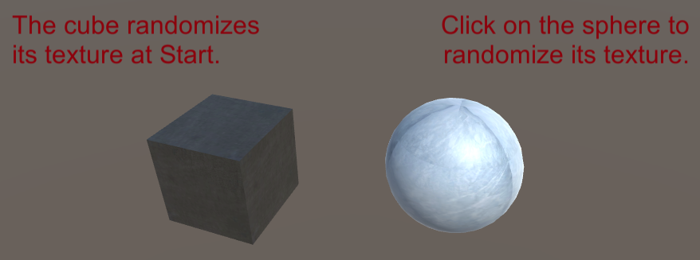

# RandomTexture

Use this if you want to randomize the texture of any object in your project.

## Getting Started

For a quick import into an existing project, just get the UnityPackage.

The DemoProject folder is an empty project with only the plugin imported and some examples! :)

## Prerequisites

There are absolutely no prerequisites to this plugin.

Everything comes into a few files (and most of them are used for demo).

## Screenshots

## Authors

* **[Arthur Cousseau](https://www.linkedin.com/in/arthurcousseau/)**

## License

This project is licensed under the MIT License - see the [LICENSE.md](LICENSE.md) file for details

## Acknowledgments

* Thanks to [Freebies](https://www.flaticon.com/authors/roundicons-freebies) for the pokemon textures used in the demo project. More at www.flaticon.com 
